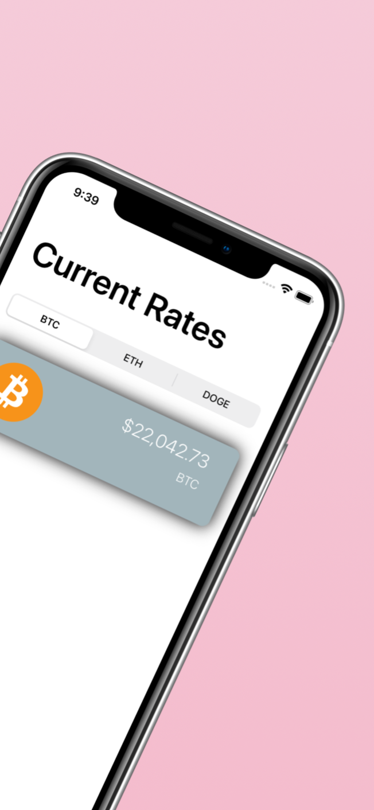
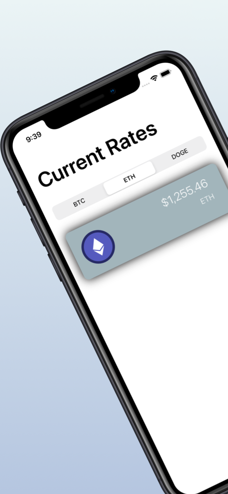
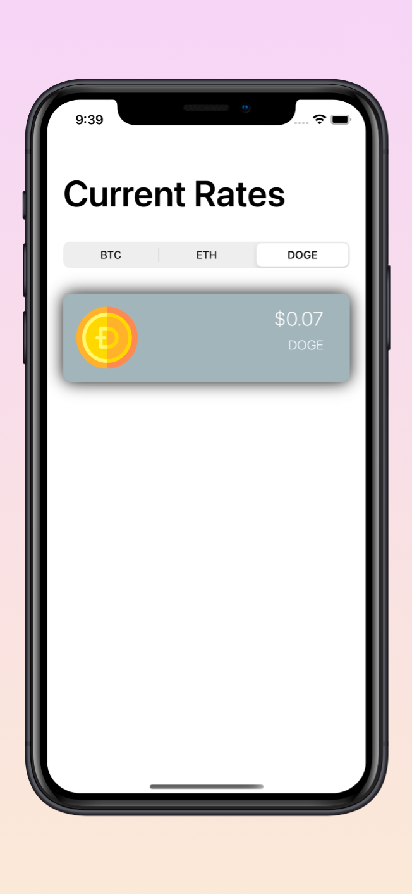

# Mintage

iOS Portfolio Application

## Description

**Mintage** is a simple crypto currency tracker that keeps a birds-eye view on the top 3 crypto currencies on the market. Track Bitcoin (BTC), Doge (DOGE), and Ethereum (ETH)

My intent with this app is to showcase my skills in consuming RESTful APIs building a dynamic application with standard iOS controls.

## Tools and Frameworks

* UIKit
* URLSession
* HTTP Requests
* JSON Parcing
* Data Modeling
* Grand Central Dispatch

## Screenshots

BTC | ETH | DOGE
:-: | :-: | :-:
|  |  |  |

## Swift and Xcode Versions

This project is build with iOS 15, Swift 5, and Xcode 13

## About Me

I'm an iOS Developer. You can connect with me on [Twitter](https://twitter.com/captainflores) @captainflores
